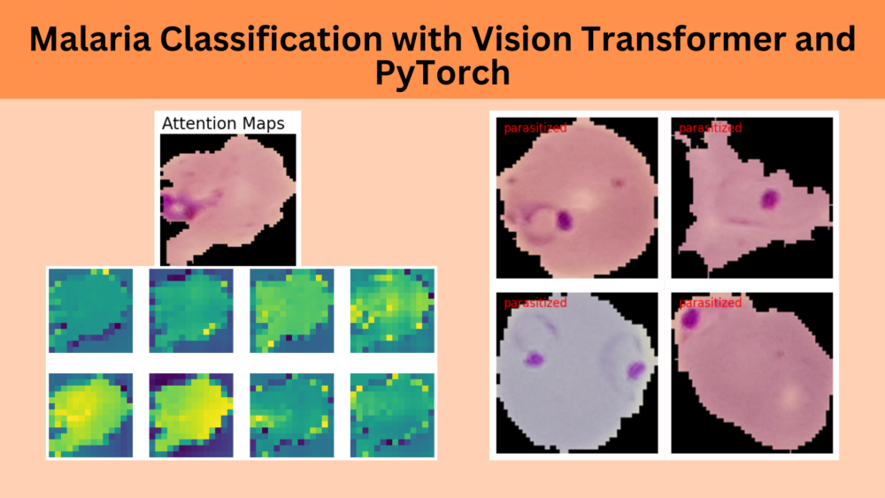

# Vision Transformers for Malaria Detection

This set of notebooks was built from the code provided by in Sovit Ranjan Rath's post here: https://debuggercafe.com/malaria-classification-with-vision-transformer-and-pytorch/

Much of the text quotes from the blog post.

## The notebooks are in the `src` folder

* [01_train.ipynb](src/01_train.ipynb)
* [02_inference.ipynb](02_inference.ipynb)

These run with AIBio Kernel from the class. See [here for details and `yaml` file](https://github.com/AIBiology/Jupyter_Content/tree/main/kernels/aibio).

